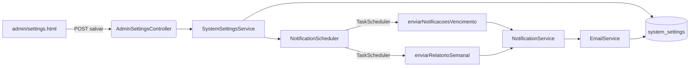

## �� **Análise Geral da Qualidade do Sistema**

### ✅ **Pontos Fortes**

#### **1. Arquitetura e Estrutura**
- **Arquitetura bem definida** com separação clara de responsabilidades (Controller → Service → Repository)
- **Padrão DTO** implementado corretamente com MapStruct para mapeamento
- **Injeção de dependência** usando `@RequiredArgsConstructor` do Lombok
- **Transações** bem configuradas com `@Transactional`

#### **2. Banco de Dados**
- **Flyway** configurado corretamente para migrações
- **Índices** apropriados (ex: `idx_data_fim` na tabela aluguel)
- **Constraints** de unicidade implementadas
- **Perfis** bem separados (PostgreSQL default, H2 para dev)

#### **3. Segurança**
- **Spring Security** configurado com autenticação
- **BCrypt** para hash de senhas
- **Controle de acesso** por roles implementado
- **Remember-me** funcional

#### **4. Funcionalidades Avançadas**
- **Sistema de notificações** por email bem estruturado
- **Agendamento** com Quartz Scheduler
- **Templates HTML** profissionais para emails
- **Validação** de dados implementada

#### **5. Testes**
- **Testes de integração** presentes
- **Configuração de teste** separada
- **CI/CD** configurado com GitHub Actions

### ⚠️ **Áreas que Precisam de Melhorias**

#### **1. Código e Boas Práticas**

**Problemas Identificados:**
```java
// ❌ Código duplicado em CacambaServiceImpl.java linha 47
if (entity.getStatus() == StatusCacamba.ALUGADA && dto.status() != StatusCacamba.ALUGADA) {
    throw new BusinessException("Não é possível alterar o status de uma caçamba alugada. Finalize ou cancele o aluguel primeiro.");
}
```

**Melhorias Sugeridas:**
- **Extração de métodos** para validações de negócio
- **Constantes** para mensagens de erro
- **Validação mais robusta** de dados de entrada

#### **2. Tratamento de Exceções**

**Problemas:**
- **Falta de logging** estruturado em alguns pontos
- **Exceções genéricas** em alguns lugares
- **Falta de rollback** explícito em operações críticas

**Melhorias:**
```java
// ✅ Exemplo de melhoria
@ExceptionHandler(BusinessException.class)
public ResponseEntity<ErrorResponse> handleBusinessException(BusinessException ex) {
    log.error("Erro de negócio: {}", ex.getMessage());
    return ResponseEntity.badRequest()
        .body(new ErrorResponse("BUSINESS_ERROR", ex.getMessage()));
}
```

#### **3. Performance e Escalabilidade**

**Problemas:**
- **N+1 queries** possíveis em algumas consultas
- **Falta de cache** para dados frequentemente acessados
- **Paginação** não otimizada em alguns endpoints

**Melhorias:**
```java
// ✅ Exemplo de consulta otimizada
@Query("SELECT a FROM Aluguel a " +
       "JOIN FETCH a.cliente " +
       "JOIN FETCH a.cacamba " +
       "WHERE a.status = :status")
List<Aluguel> findByStatusWithJoins(@Param("status") StatusAluguel status);
```

#### **4. Segurança**

**Problemas:**
- **Credenciais hardcoded** no `application.properties`
- **Falta de rate limiting**
- **Logs sensíveis** podem vazar informações

**Melhorias:**
```properties
# ✅ Usar variáveis de ambiente
spring.mail.username=${EMAIL_USERNAME}
spring.mail.password=${EMAIL_PASSWORD}
```

#### **5. Monitoramento e Observabilidade**

**Faltando:**
- **Métricas** de aplicação
- **Health checks** customizados
- **Tracing** distribuído
- **Alertas** automáticos

#### **6. Documentação**

**Problemas:**
- **Falta de JavaDoc** em métodos críticos
- **API não documentada** (Swagger/OpenAPI)
- **README** poderia ser mais detalhado

### 🔧 **Melhorias Prioritárias Recomendadas**

#### **1. Imediatas (Alta Prioridade)**

1. **Remover credenciais hardcoded**
2. **Adicionar logging estruturado**
3. **Implementar validações mais robustas**
4. **Adicionar documentação da API**

#### **2. Médio Prazo (Média Prioridade)**

1. **Implementar cache** (Redis/EhCache)
2. **Otimizar consultas** com JOIN FETCH
3. **Adicionar métricas** (Micrometer)
4. **Implementar rate limiting**

#### **3. Longo Prazo (Baixa Prioridade)**

1. **Migrar para microserviços** se necessário
2. **Implementar event sourcing**
3. **Adicionar testes de performance**
4. **Implementar CI/CD mais robusto**

### 📈 **Score de Qualidade: 7.5/10**

**Justificativa:**
- ✅ **Arquitetura sólida** (9/10)
- ✅ **Funcionalidades completas** (8/10)
- ⚠️ **Código com algumas melhorias** (7/10)
- ⚠️ **Segurança básica** (7/10)
- ⚠️ **Monitoramento limitado** (6/10)
- ✅ **Testes presentes** (8/10)

### �� **Conclusão**

Seu sistema está **bem estruturado** e **funcional**, com uma base sólida. As principais melhorias são relacionadas a **boas práticas de código**, **segurança** e **observabilidade**. O projeto demonstra conhecimento técnico sólido e está pronto para produção com algumas melhorias pontuais.

**Recomendação:** Foque primeiro nas melhorias de segurança e logging, depois nas otimizações de performance. O sistema já está em um bom nível para uso em produção.

---

## 🔐 Autenticação e Painel Administrativo (estado atual)

- **Cadeias de segurança**
  - **/admin/**: exige `ROLE_ADMIN`. Página de login em `"/admin/login"`, processamento em `"/admin/auth/login"`, sucesso redireciona para `"/admin"`. Logout em `"/admin/logout"`. CSRF habilitado; remember-me ativo (24h).
  - **/ui/**: páginas gerais da aplicação. Login em `"/login"`, processamento em `"/auth/login"`, sucesso via `CustomAuthenticationSuccessHandler` para `"/ui"`.

- **Provider de autenticação**
  - Único `DaoAuthenticationProvider` com `CustomUserDetailsService` (carrega por username ou email) e `PasswordEncoder` BCrypt.
  - Authorities no formato `ROLE_<ROLE>` baseadas em `User.role`.

- **Bootstrap do primeiro administrador**
  - `AdminBootstrapRunner` executa no startup. Se não existir nenhum usuário com `ROLE_ADMIN`, cria um admin.
  - Variáveis de ambiente suportadas: `APP_ADMIN_USERNAME`, `APP_ADMIN_EMAIL`, `APP_ADMIN_PASSWORD`.
  - Se a senha não for informada, é gerada uma senha temporária forte e registrada uma única vez no log de inicialização.
  - Migration `V8__remove_seeded_admin.sql` remove seeds antigos para padronizar a criação via bootstrap.

- **Páginas do Painel Admin** (Thymeleaf)
  - `admin/login.html`, `admin/index.html`, `admin/settings.html`, `admin/import.html`, `admin/users.html`, `admin/reports.html`.
  - Mensagens de erro são genéricas. O “motivo técnico” foi removido da UI; o detalhe permanece apenas nos logs do servidor.

### Diagrama (Mermaid) – Configurações de Notificações



Descrição rápida:
- A página `admin/settings.html` envia mudanças para `AdminSettingsController`.
- `SystemSettingsService` persiste em `system_settings` e notifica o `NotificationScheduler` para reagendar.
- As tarefas executam `NotificationService`, que usa `EmailService`; ambos leem as configurações correntes.

- **Observabilidade de falhas**
  - `AdminAuthenticationFailureHandler`: registra tentativas de login malsucedidas do painel (sem vazar detalhes ao usuário).

---

## ✅ Itens implementados para o painel administrativo

- Rota dedicada `"/admin/**"` isolada da UI.
- Autenticação por banco usando o mesmo provider da aplicação.
- Bootstrap automático do primeiro admin via variáveis de ambiente.
- CSRF, remember-me e logout configurados.
- Seeds antigos neutralizados via Flyway (V8).

---

## 📌 Backlog sugerido (boas práticas de segurança e UX)

- **Troca de senha obrigatória** no primeiro login do admin bootstrapado.
- **Política de senhas**: tamanho mínimo, complexidade, histórico, expiração opcional.
- **Proteção contra força bruta**: lockout temporário após N falhas e/ou rate limit por IP.
- **2FA** no `/admin/**` (TOTP ou e-mail OTP).
- **Gestão de usuários no painel**: CRUD de usuários e atribuição de roles (ADMIN/MANAGER/USER).
- **Reset de senha** seguro via token por e-mail.
- **Endurecimento de cookies**: `Secure`, `HttpOnly`, `SameSite=Strict` em produção; `rememberMe.key` externo (env/secret manager).
- **Perfis e features de dev**: endpoints de diagnóstico somente em `dev` (já aplicado para `/dev/security/**`).
- **Desativar `spring.jpa.open-in-view`** em produção para reduzir riscos e consumo no render de views.
- **Monitoramento**: métricas e contadores de tentativas de login (Micrometer), health checks customizados.
- **SSO/IdP (opcional)**: suporte a OpenID Connect/OAuth2 com mapeamento de grupos para roles.
