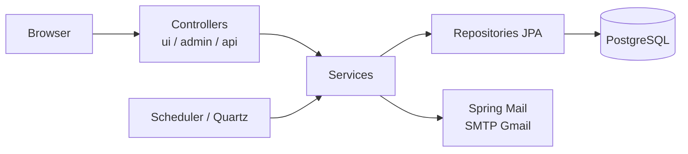

# Caçamba Manager

Sistema de gestão de aluguel de caçambas: cadastro de clientes e caçambas, controle de contratos de aluguel com histórico, notificações de vencimento por email e painel administrativo. Full-stack em um único repo — backend Spring Boot com frontend server-side em Thymeleaf. Repositório privado, MVP funcional.

## Arquitetura

MVC clássico em camadas, sem SPA — o Thymeleaf renderiza as telas no servidor.



- **Controllers** divididos em `ui/` (páginas Thymeleaf), `admin/` (settings, importação, relatórios) e `api/` (REST) — 19 controllers no total.
- **Regra de negócio D+1**: a data de início do aluguel é a data de entrega + 1 dia, aplicada via `EntityListener` (`AluguelLifecycle`).
- **Entidades**: `Cliente`, `Cacamba`, `Aluguel`, `AluguelHistorico`, `User`, `Notification`, `SystemSettings`.

## Stack

| Tecnologia | Por quê |
|---|---|
| Java 17 + Spring Boot 3.5.4 | Base do backend; LTS estável |
| PostgreSQL 15 (Docker) / H2 (dev) | Banco principal; H2 em memória para desenvolvimento rápido |
| Flyway (14 migrations) | Schema versionado no repo, sem `ddl-auto` |
| Thymeleaf + layout-dialect | Frontend server-side sem build de front separado |
| Spring Security + BCrypt | Login com roles `ADMIN`/`USER` e remember-me |
| MapStruct | Mapeamento entity ↔ DTO sem boilerplate |
| Spring Mail (SMTP Gmail) | Notificações de vencimento e relatórios por email |
| Quartz / `@Scheduled` | Envio agendado com horários/dias configuráveis em runtime |
| commons-validator | Validação de emails na importação/cadastro |

## Features implementadas

- CRUD de clientes (email/contato opcionais, opt-in de notificações)
- CRUD de caçambas com código único, capacidade e status (bloqueio de edição quando alugada)
- Contratos de aluguel: criação, finalização, filtros por situação (incl. "Vencendo": vencidos + hoje + próximos 7 dias), ordenação por vencimento, histórico (`AluguelHistorico`)
- Dashboard com alertas de vencimento
- Notificações por email: vencimentos e relatório semanal, com agendamento dinâmico configurável em `admin/settings` (horários, dias da semana, timezone, toggle geral, teste de envio)
- Relatórios CSV (ex.: `/admin/reports/alugueis.csv`)
- Importação em massa via CSV (clientes, caçambas, contratos) — ver `INSTRUCOES_IMPORTACAO.md`
- Autenticação e gestão de usuários admin

## Como rodar

Pré-requisitos: Java 17+, Docker.

### 1. Banco de dados

```bash
docker-compose up -d   # PostgreSQL 15 em localhost:5432 (db: cacamba)
```

### 2. Variáveis de ambiente

O envio de email exige (sem defaults — definir antes de subir a aplicação):

- `EMAIL_USERNAME` — conta Gmail remetente
- `EMAIL_PASSWORD` — App Password do Gmail (nunca commitar)
- `EMAIL_REPORT_TO` — destino dos relatórios (opcional; cai no `EMAIL_USERNAME` se não definida)

### 3. Aplicação

```bash
# default: PostgreSQL do docker-compose
./mvnw spring-boot:run

# dev: H2 em memória (console em /h2-console)
./mvnw spring-boot:run "-Dspring-boot.run.profiles=dev"

# prod: config de produção (open-in-view desligado etc.)
./mvnw spring-boot:run "-Dspring-boot.run.profiles=prod"
```

Acesso: http://localhost:8080

Profiles: `default` (PostgreSQL), `dev` (H2), `postgres`, `prod`.

## Estrutura

```
src/main/java/com/eccolimp/cacamba_manager/
├── controller/        # ui/ (Thymeleaf), admin/, api/ (REST)
├── domain/            # model/, repository/ (+spec/), service/, AluguelLifecycle
├── dto/  mapper/      # DTOs + MapStruct
├── notification/      # model, repository, scheduling, service
├── report/            # relatórios CSV
├── security/          # config, filter, controllers, users
└── util/
src/main/resources/
├── db/migration/      # Flyway V1..V15
├── templates/         # Thymeleaf (páginas + emails)
└── application*.properties
```

## Testes

```bash
./mvnw test
```

JUnit 5 + Mockito; testes de service, validação de controller, notificações e segurança. CI no GitHub Actions (`.github/workflows/ci.yml`) roda o build Maven em push/PR na `main`.

## Em desenvolvimento (branch `developer`)

Trabalho em andamento, ainda não commitado:

- **Regra D+1** — `AluguelLifecycle` (EntityListener) + migration `V15__add_data_entrega_and_prazo_dias.sql` (campos `data_entrega` e `prazo_dias` no aluguel) + `RegraDmais1Test`
- **Importação em massa CSV** — recém-adicionada (`AdminImportController`), em estabilização; exemplos de CSV em revisão
- Ajustes em filtros/ordenação de aluguéis (`SituacaoVencimento`, specifications) e templates do dashboard

## Documentação complementar

- `PROJECT_OVERVIEW.md` — análise de qualidade e pontos de melhoria
- `PROJECT_KNOWLEDGE.md` — decisões e histórico de implementação (settings de notificação, fix de LazyInitialization no CSV, ordenação por vencimento)
- `DATABASE_SETUP.md`, `EMAIL_SETUP.md`, `INSTRUCOES_IMPORTACAO.md` — setups específicos
